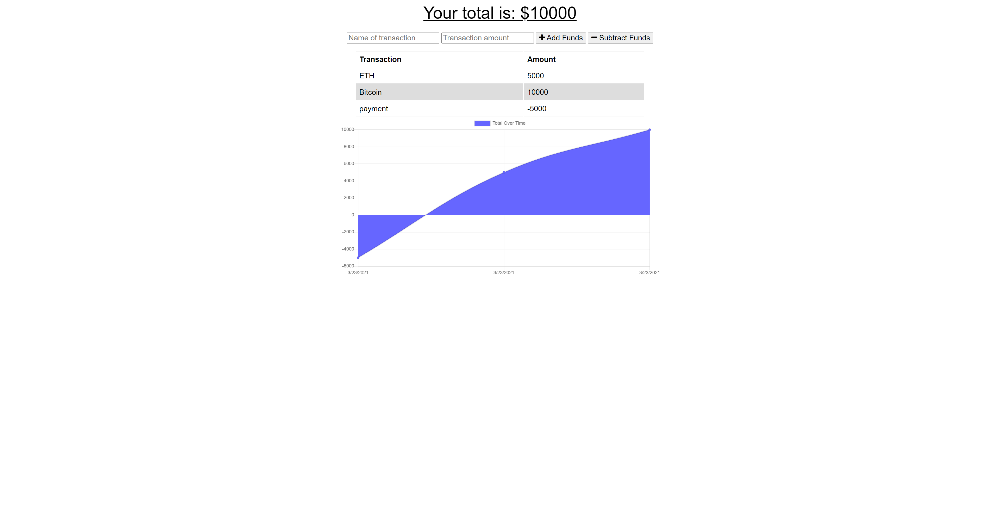

# Hardware Wallet

A Budget Tracker application that allows users to add expenses and deposits to their budget with or without a connection. When entering transactions offline, they should populate the total when brought back online.

## Table of Contents

- [Installation](#installation)
- [Usage](#usage)
- [Links](#Links)
- [Technologies](#Technologies)
- [License](#License)

## Installation

1. Download or clone repository
2. `npm install` to install the required npm packages to run

## Usage

- Application will be invoked by using the following command:

  `node server.js`

- Open your browser and go to

  `http://localhost:3000`

- User can add transactions as deposits or expenses.

- The total amount is reflected as soon as funds are entered.

- The graph portrays the total funds over time by date entered for each transaction

- The app can be used online and offline

- Offline Functionality:

  - Enter deposits offline
  - Enter expenses offline

- When brought back online:

  - Offline entries should be added to tracker

- There is also the option to download the app

## Links

- [Github](https://github.com/jongomezdev/Hardware-wallet)
- [Live Heroku App](https://hardware-wallet.herokuapp.com/)

## Technologies

- Node
- Express
- JavaScript
- MongoDB
- Mongoose
- Progressive Web Application

## License

This program is free software: you can redistribute it and/or modify
it under the terms of the GNU General Public License as published by
the Free Software Foundation, either version 3 of the License, or
(at your option) any later version.
This program is distributed in the hope that it will be useful,
but WITHOUT ANY WARRANTY; without even the implied warranty of
MERCHANTABILITY or FITNESS FOR A PARTICULAR PURPOSE.See the
GNU General Public License for more details.
You should have received a copy of the GNU General Public License
along with this program. If not, see <https://www.gnu.org/licenses/>

## Contributing

Open source, feel free to modify and change! Please share the results.

## Questions

Check out my other repositories in the link below:

- [GitHub Profile](https://github.com/jongomezdev)

- For any additional questions, please [email](mailto:jongomezdev@gmail.com) me.

## Demo

The following animation demonstrates the application functionality:

